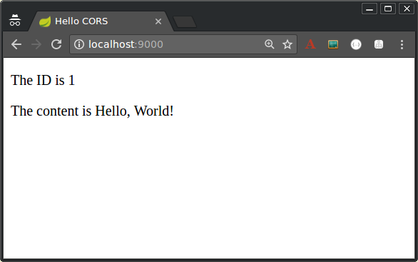
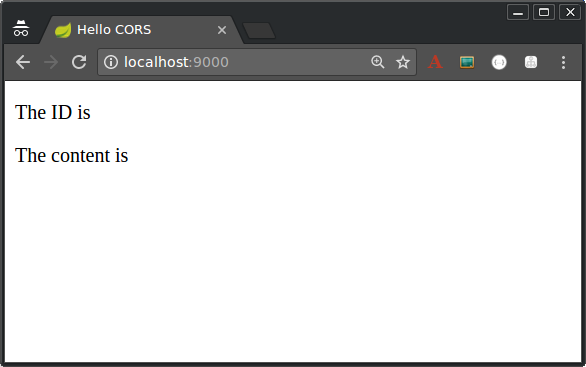

# Greeting Client

This project calls the greeting service.

## Building the project
You can build the project using maven. Run the following command in command line.

```
$ mvn clean install
```
This should create the required executables files.

## Starting Greeting service

```
$ java -jar ./target/greeting-client-<SERVICE_VERSION>.jar
```

OR

You can start the service using Spring Boot maven plugin by running below command. You can append `-Dserver.port=9000` argument to start the service on different port.

```
mvn spring-boot:run -Dserver.port=9000
```

This will start greeting client on port 9000.

## Testing the client for CORS configuration

The gateway service has a CORS configuration to allow request originating from http://localhost:9000. If you run the greeting client on different port or host then the calls from greeting client will be filtered by CORS filter. 

Once the client starts, open http://localhost:9000 in your browser, where you should see:



If the service response includes the CORS headers, then the ID and content will be rendered into the page. But if the CORS headers are missing (or insufficiently defined for the client), then the browser will fail the request and the values will not be rendered into the DOM:




 


 
